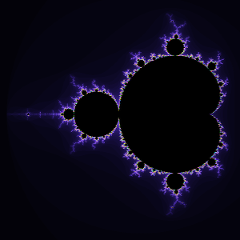
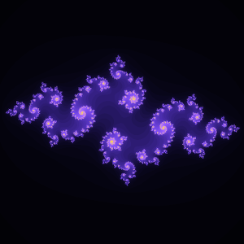
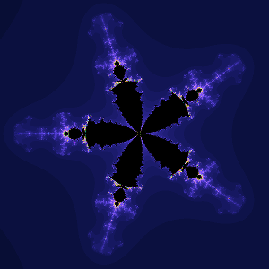

# ComplexFractal
It's example of the application for drawing some fractals. This application uses JavaFX for GUI.

The application can draw and save images of fractals, such as:
- Mandelbrot set;
- Julia set;
- and some other.

JDK 8u40 or greater is required for compiling this project.
